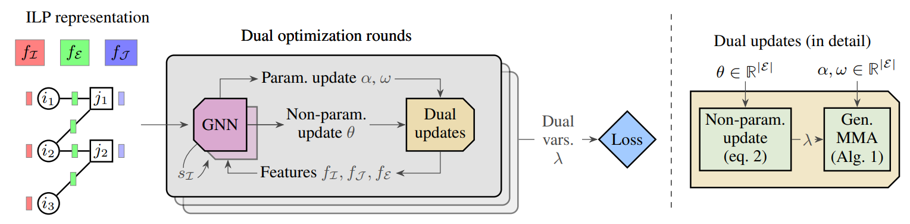
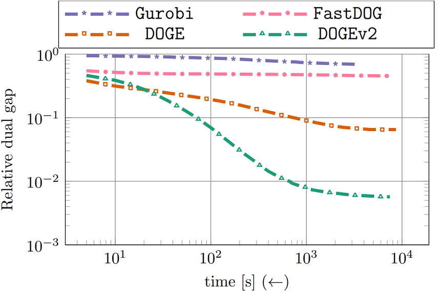

# DOGE-Train: Discrete optimization on GPU with end-to-end training
A fast, scalable, data-driven approach for solving relaxations of 0-1 integer linear programs on GPU.


## Requirements
We use `Pytorch 2.0` and `CUDA 11.8`. `Gurobi` is used as one of the baselines and also for parsing ILPs. Consult `install.sh` for installing all requirements.

## Datasets
### 1. Synthetic problems
First generate synthetic problems through the following command:
```bash
python data/generate_independent_set_inst.py
```
This will generate independent set problem instances as used in the paper and write them in `datasets/MIS` directory. 

### 2. Custom datasets
For other datasets used in the paper we provide config files containing all hyperparameters in the `configs` folder. Modify the variable `DATA_DIR` in the config file appropriately. The files should be organized as follows 

```
<DATA_DIR>/train_split/instances/<training .lp files here>
<DATA_DIR>/test_split/instances/<testing .lp files here>
```

See `configs/config_mis.py` for an example. 

## Training
For synthetic independent set problems generated above run `train_mis.sh` script. For details about configs, command-line parameters see `configs/config_mis.py`, `configs/default` and `train_doge.py`.
Note that for testing we automatically run Gurobi for comparison. This can be disabled by setting `need_gt = False` in `configs/config_mis.py`. 

## Code organization
- `train_doge.py`: Entry point. 
- `doge.py`: Code for training and testing. Uses `pytorch lightning` for ease of use. 
- `configs/`: Contains configuration files for all datasets. 
- `data/`: Contains code related to ILP reading, processing etc. 
- `model/model.py`: Contains the neural network related code. 
- `model/solver_utils.py`: Provides interface to the parallel deferred min-marginal averaging algorithm, computes features sent as input to the GNN, and contains other helper functions.
- `external/`: Contains external dependencies. 

## Updates
1. Added gradient of smoothed dual objective with varying degrees of smoothing, as features to the GNN. This improves results significantly on difficult dataset of QAPLib (config file: `configs/config_qaplib.py`). Result comparison is

2. Added replay buffer to store past trajectories, instead of running the solver from scratch see [`doge.py:219`](https://github.com/aabbas90/DOGE-Train/blob/4160384377bd0a87313efb64a30119cc9e9aba58/doge.py#L219). This helps the non-LSTM version (DOGE) to have faster training by up to 4x. For LSTM version using replay buffer makes results worse possibly because we need to store cell states as well however these
stored cell states become out-of-date when the network is updated. Therefore we recommend not using replay buffer with LSTM variant. 
